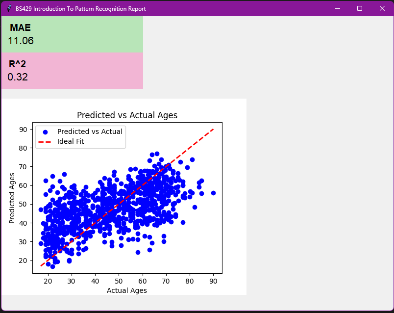

# BS429 - Introduction to Pattern Recognition Final Project
## Biological Age Prediction from Gut Microbiome Data

This project aims to predict biological age from fecal microbiome compositions using machine learning techniques.

## 📋 Project Overview

The gut microbiome composition changes with age and can serve as a biomarker for biological aging. This project uses XGBoost regression to predict an individual's biological age based on their gut microbiota DNA sequence data.

## 📊 Dataset

The dataset used in this project contains gut microbiome composition data from **4,274 individuals** along with their corresponding biological ages.

### Data Files

- **Ages.csv**: Contains sample identifiers and corresponding biological ages
  - Columns: `Sample Accession`, `Age`
  
- **data.csv**: Contains sample identifiers and DNA fragment counts for each microorganism species
  - Features: 3,200 different microorganism species
  - Each column represents the abundance of a specific microorganism

## 🔧 Technologies Used

- **Python 3.x**
- **pandas**: Data manipulation and analysis
- **numpy**: Numerical computing
- **scikit-learn**: Machine learning utilities (train/test split, metrics)
- **XGBoost**: Gradient boosting regression model
- **tkinter**: GUI for results visualization
- **matplotlib**: Data visualization

## 🚀 Installation

1. Clone this repository:
```bash
git clone <repository-url>
cd BS429-Final-Project
```

2. Install required packages:
```bash
pip install pandas numpy scikit-learn xgboost matplotlib
```

## 💻 Usage

Run the classifier script:
```bash
python classifier.py
```

The program will:
1. Load and preprocess the microbiome data
2. Train an XGBoost regression model (80/20 train-test split)
3. Evaluate the model performance
4. Display results in a GUI window with:
   - Mean Absolute Error (MAE)
   - R² Score
   - Scatter plot of Predicted vs Actual Ages

## 📈 Model Performance

The model uses **XGBoost Regressor** with the following configuration:
- Number of estimators: 100
- Random state: 42
- Test size: 20% of the dataset

### Evaluation Metrics

- **Mean Absolute Error (MAE)**: Measures the average magnitude of errors in predictions
- **R² Score**: Indicates how well the model explains the variance in the target variable

## 📸 Results



The visualization shows:
- Blue points: Predicted vs Actual ages for test samples
- Red dashed line: Ideal fit (perfect predictions)
- The closer points are to the red line, the better the model's predictions

## 🔬 Methodology

1. **Data Loading**: Import microbiome abundance data and age labels
2. **Data Cleaning**: 
   - Rename columns for clarity
   - Remove unnecessary columns
   - Merge datasets on Sample Accession
3. **Preprocessing**:
   - Convert all features to numeric type
   - Fill missing values with 0
4. **Model Training**: Train XGBoost regressor on 80% of the data
5. **Evaluation**: Test model on remaining 20% of data
6. **Visualization**: Display results using tkinter GUI with matplotlib integration


## 📄 License

This project is for educational purposes as part of the BS429 course.
